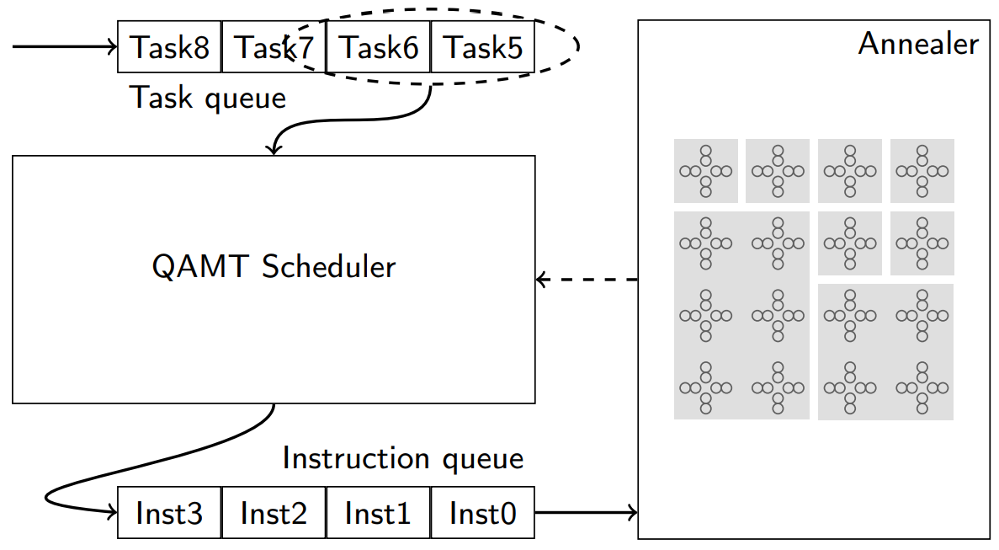
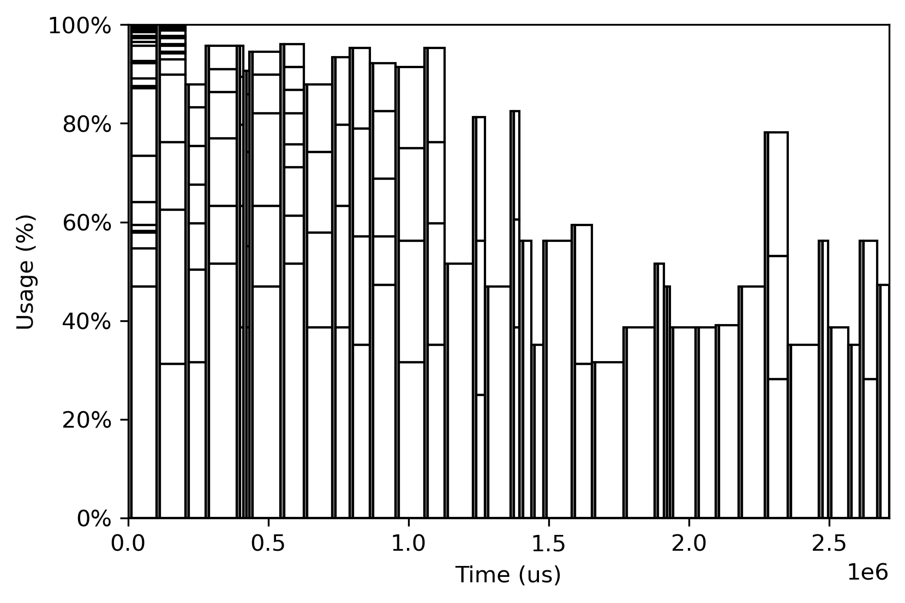
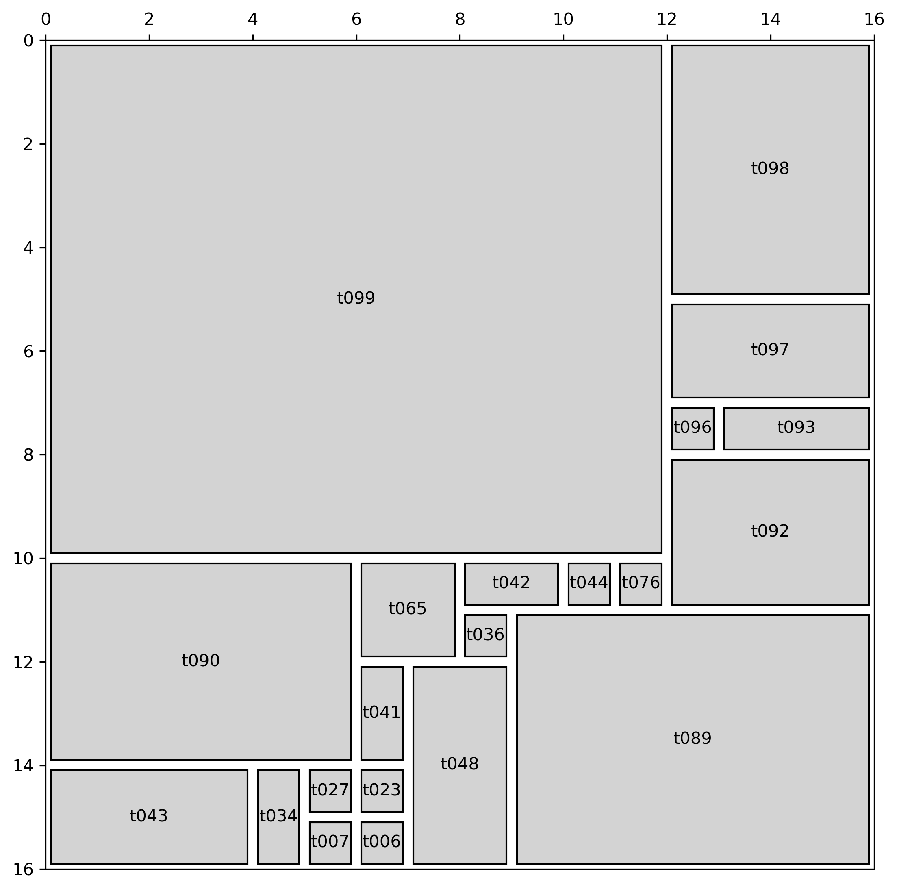

# QAMTSimulator

QAMTSimulator stands for Quantum Annealing Multitasking Simulator.

This simulator is for simulating Multitasking on Quantum Annealing devices. Multitasking would improve the resource utilisation of quantum annealers. The capacity of quantum computers has been scaled up several thousand times in the past two decades. We believe that the need for QAMT also increases along with the capacity of a quantum annealer. Time-critical applications such as automation control and autonomous driving would benefit from QAMT, as the execution time of tasks is known. Multitasking would also enable virtualisation of quantum annealers, allowing multiple users to share a quantum annealer without knowing the existence of other users. The sharing of quantum annealers would reduce the cost of usage and spark new applications and opportunities.

We employ a lot of terminologies from [D-Wave](https://www.dwavesys.com/) quantum annealing systems. But the simulator applies to any quantum computing system that adopt ``Array of unit cells`` design methodology.


## Introduction

We develop an event-based QAMTS simulator in Python that serves as a platform to evaluate scheduling algorithms for QAMT. The figure below shows the diagram of the simulator. It takes a series of tasks as input. A QAMT scheduler combines one or multiple tasks into an instruction. The scheduler may consider the status of the annealer when translating tasks into instructions. The instructions are fed into an annealer and executed sequentially.



To facilitate the development and evaluation of various scheduling algorithms, we implemented a few visualisation tools along with the simulator. These tools inspect scheduling from a space allocation and time scheduling point of view.





The figure above shows the allocation of space produced by a scheduling algorithm.  X axis is time, Y axis is resource utilisation. A long vertical bar has a few segments, which indicate the space in that period is shared by a few tasks.





The figure above shows the timing aspect of tasks achieved by the demo schedule. The device has a 16x16 unit cells. A gray block represents the resource occupied by a task.


## Usage

```python
#import a few modules
from qamts.simulator import QAMTSimulator
from qamts.scheduler import ToyScheduler
from qamts.annealer import Chimera
from qamts.instruction import QMI
from qamts.task import Task
from qamts.utils import randomTasks

#Randomly generate a set of tasks
tasks = randomTasks(4, anneal_time=100, seed=0)
tasks = Task.load(tasks)

#Create an instance of processor with 16x16 unit cells
processor = Chimera()

#Create an instance of a toy scheduler
scheduler = ToyScheduler()

#Create an instance of the simulator.
sim = QAMTSimulator(
    tasks,
    processor,
    scheduler,
)

#Run it
sim.run()
    
```

For more detailed usage, please check this [example](examples/example.ipynb)

## Citation

This is a python implementation of the work in the following paper:  
Huang, Tian and Zhu, Yongxin and Goh, Rick Siow Mong and Luo, Tao, When Quantum Annealing Meets Multitasking: Potentials, Challenges and Opportunities. Available at SSRN: https://ssrn.com/abstract=4252155 or http://dx.doi.org/10.2139/ssrn.4252155

Bibtex citation:  
```tex
@article{huang2022quantum,  
  title={When Quantum Annealing Meets Multitasking: Potentials, Challenges and Opportunities},  
  author={Huang, Tian and Zhu, Yongxin and Rick, Goh Siow Mong and Luo, Tao},  
  journal={SSRN},  
  year={2022}  
}  
```
